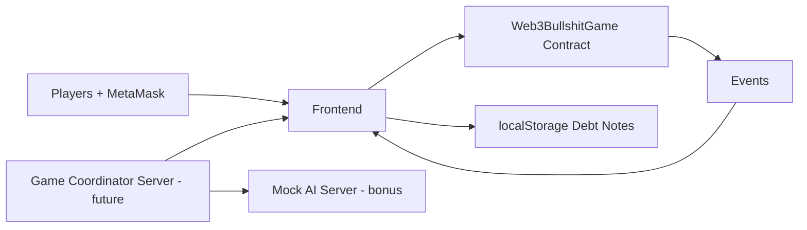

# Web3 吹牛遊戲全系統開發規劃書

## 1. 專案定位

本專案是區塊鏈期末 DApp，主目標是展示完整 smart contract workflow。系統採用「鏈上押金 + 前端遊戲互動 + 鏈上抓吹牛裁決」架構，讓合約承擔最重要的資產安全與輸贏判定責任；EIP-712 債券簽名保留為備用結算示範。

AI 伺服器與完整 SRA Mental Poker 屬於後續擴充；第一版 demo 先以 deck commitment 模擬隱私洗牌存證，確保課堂展示可穩定完成。

## 2. 課程要求對齊

| 要求 | 實作位置 |
| --- | --- |
| Smart Contract 主體 | `contracts/Web3BullshitGame.sol` |
| State variables | `owner`, `deposits`, `rooms`, `roomIds`, `usedNonces` |
| Struct / Mapping / Array | `Room`, `DebtNote`, room/player/deposit mappings |
| Events | Deposit、RoomCreated、PlayerJoined、GameStarted、DebtSettled |
| Modifier | onlyOwner、roomExists、onlyHost、inStatus |
| Require / Revert | 押金不足、錯誤狀態、重複 nonce、無效簽名 |
| Role-based permission | host 控制房間開始/結束，winner 才可兌換債券 |
| Frontend | `frontend/index.html`, `frontend/app.js` |
| ethers.js / MetaMask | 前端連線、交易、EIP-712 簽名 |
| Event display | 前端事件與交易 log |
| Mock AI Server | bonus，第二階段補上 |

## 3. 系統架構



## 4. 核心流程

### 4.1 資金質押

玩家呼叫 `deposit()`，ETH 進入合約，`deposits[player]` 增加。房間加入時會檢查玩家押金是否達到 `stakeRequired`。

### 4.2 房間建立

host 呼叫 `createRoom(roomId, stakeRequired)`，合約建立 Lobby 狀態房間並把 host 加入 players。其他玩家呼叫 `joinRoom(roomId)`，滿 4 人才可開始。

### 4.3 隱私洗牌承諾

第一版 demo 中，前端或未來 server 產生 `deckCommitment = keccak256(encryptedDeck)`。host 呼叫 `startGame(roomId, deckCommitment)`，合約只存 hash，不知道任何牌面。

完整 SRA Mental Poker 會在第二階段加入：

1. server 建立 52 張牌的原始資料。
2. server 與 4 位玩家依序加密與洗牌。
3. 最終 encrypted deck hash 上鏈。
4. 玩家抽牌時向其他玩家請求局部解密資料。

### 4.4 債券簽發

輸家用 MetaMask 簽 EIP-712 `DebtNote`：

```solidity
struct DebtNote {
    bytes32 roomId;
    address winner;
    uint256 amount;
    uint256 nonce;
    uint256 expiration;
}
```

簽名 JSON 儲存在贏家瀏覽器 localStorage，server 只需轉發，不碰資金。

### 4.5 鏈上裁決、結算與提款

玩家抓吹牛時呼叫 `settleChallenge(roomId, actor, claimRank, actualRanks, amount)`。合約檢查房間狀態、雙方玩家身份、宣稱點數、實際翻牌與鬼牌規則。若宣稱成立，抓牌者輸；若宣稱不成立，出牌者輸。合約直接從輸家的 deposits 扣款給贏家，不需要輸家額外簽名。玩家最後用 `withdraw(amount)` 領回剩餘 ETH。

## 5. 安全設計

- Room ID 防止跨房間重放。
- Nonce 防止同一張債券重複兌換。
- Expiration 防止過期債券被拿來結算。
- winner 必須是 `msg.sender`，避免別人代領。
- debtor 與 winner 都必須是房間玩家。
- host-only 操作保護 start/finish。
- 狀態機保護錯誤流程。

## 6. Demo 重點

1. 展示 4 人押金與加入房間。
2. 展示 `GameStarted` event 內的 deck commitment。
3. 展示輸家簽署 Debt Note，贏家一次結算。
4. 展示重複 nonce 會 revert。
5. 展示非 host 呼叫 `startGame` 會 revert。

## 7. 後續功能

- Node.js + Socket.io 遊戲同步伺服器。
- Mock AI Server：吹牛機率建議、回合摘要、疑似作弊提示。
- SRA commutative encryption 實作與驗證。
- 更完整的吹牛遊戲回合 UI。
- 多張 debt note 批次結算 `settleDebts()`.
